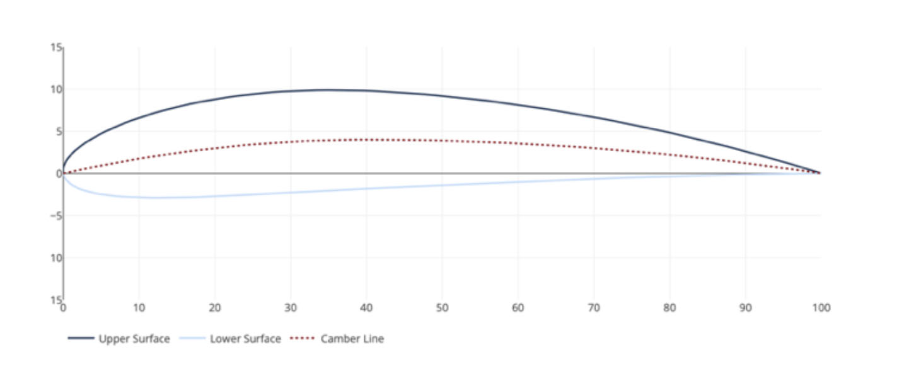
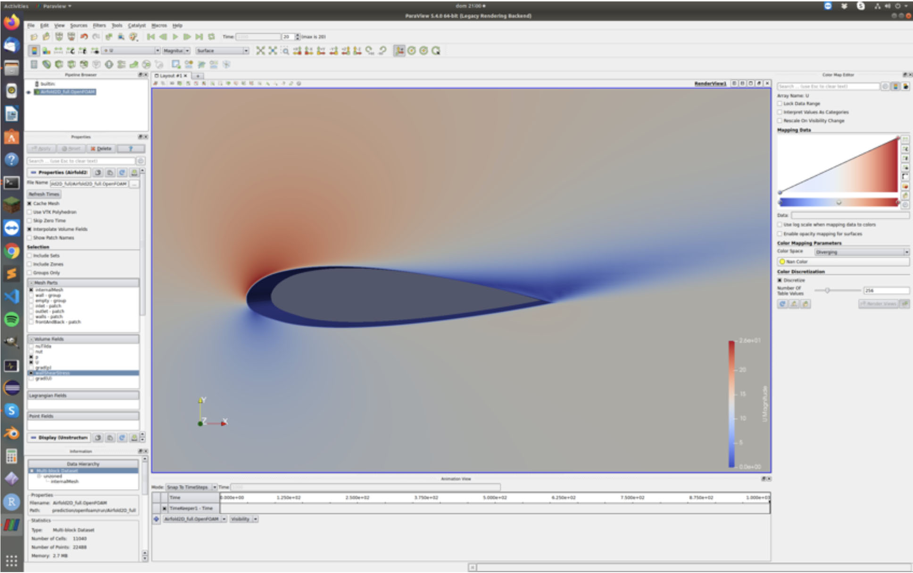
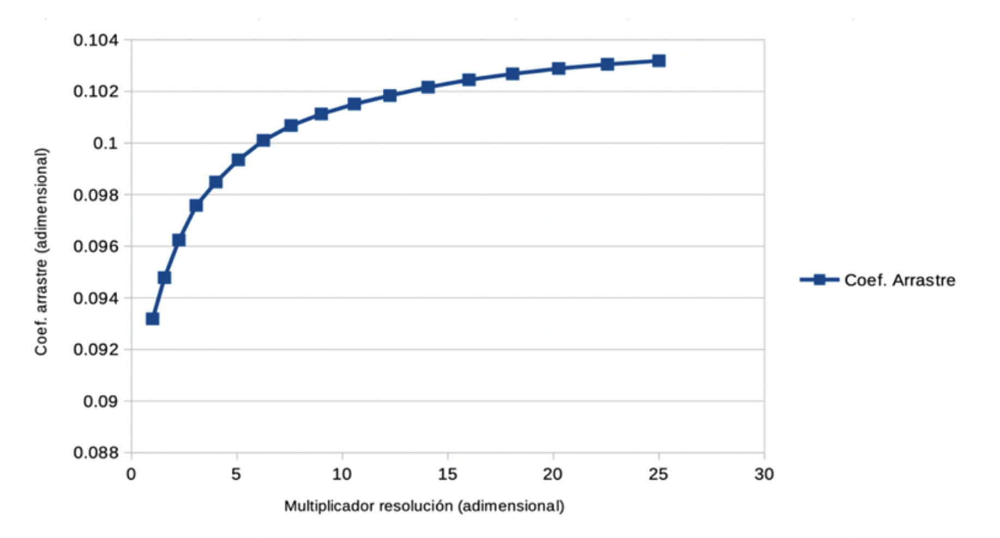
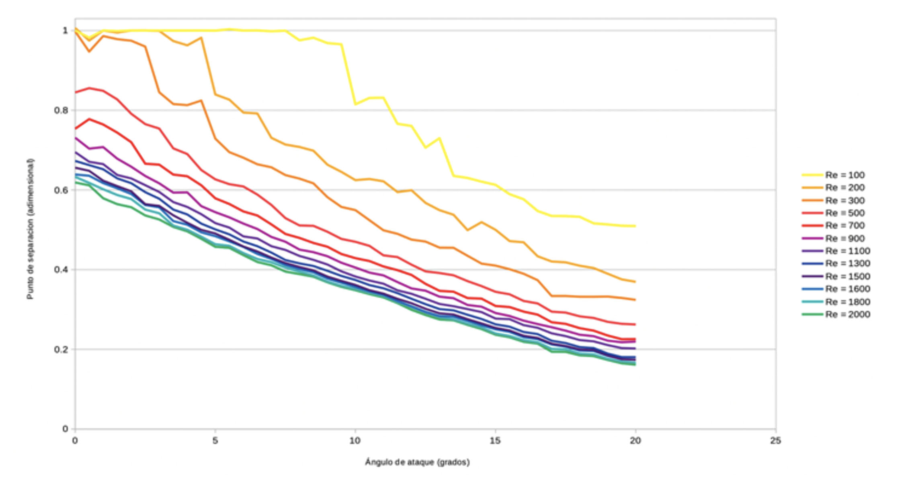
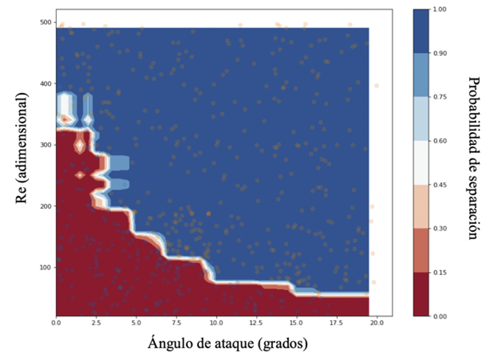

# flow-separation-prediction
Flow separation prediction.

The goal of this project is to generate the dataset and train a model to predict the **point of flow separation** over the profile of a NACA parametrized airfoil.

An example of NACA airfoil profile:

To generate the dataset, multiple passes of a simulation are run under different conditions (Reynold's number and angle of attack), and the point of flow separation (if separation occurs) is measured from simulation data and annotated into the dataset.

OpenFOAM was used to run the simulations using the SIMPLE solver:

A convergence study was carried out to determine how fine the simulation domain grid should be. The mesh was refined until convergence (change below threshold) was achieved.

The result was a trained model that, within the tight restrictions of the project, produced a result accurate within 2%.

A plot of the learnt function for different values of Re and angle of attack:

It was also interesting to visualize the separation/no separation boundary in parameter space:

This project was awarded top marks by the Commitee.
